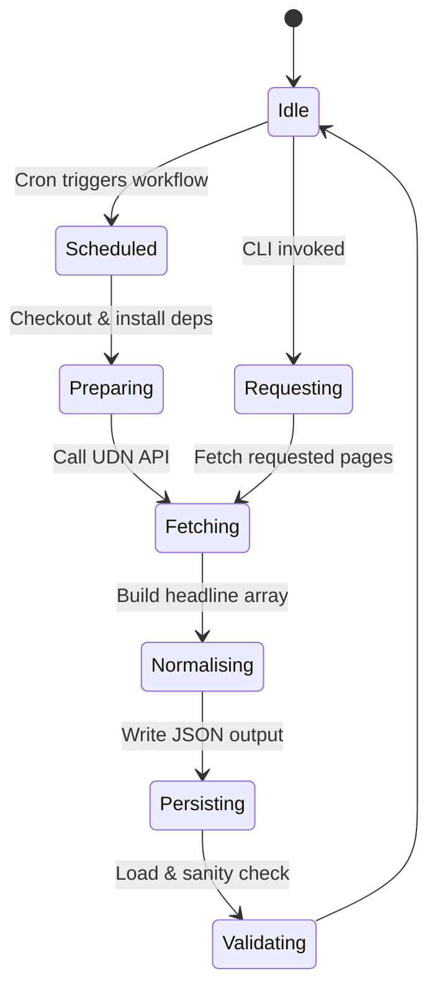
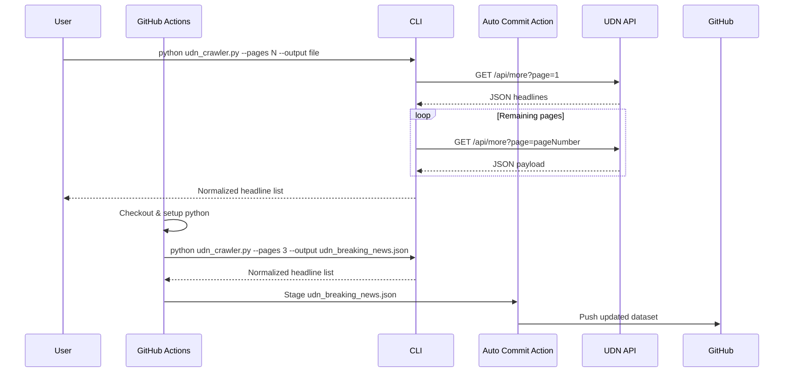
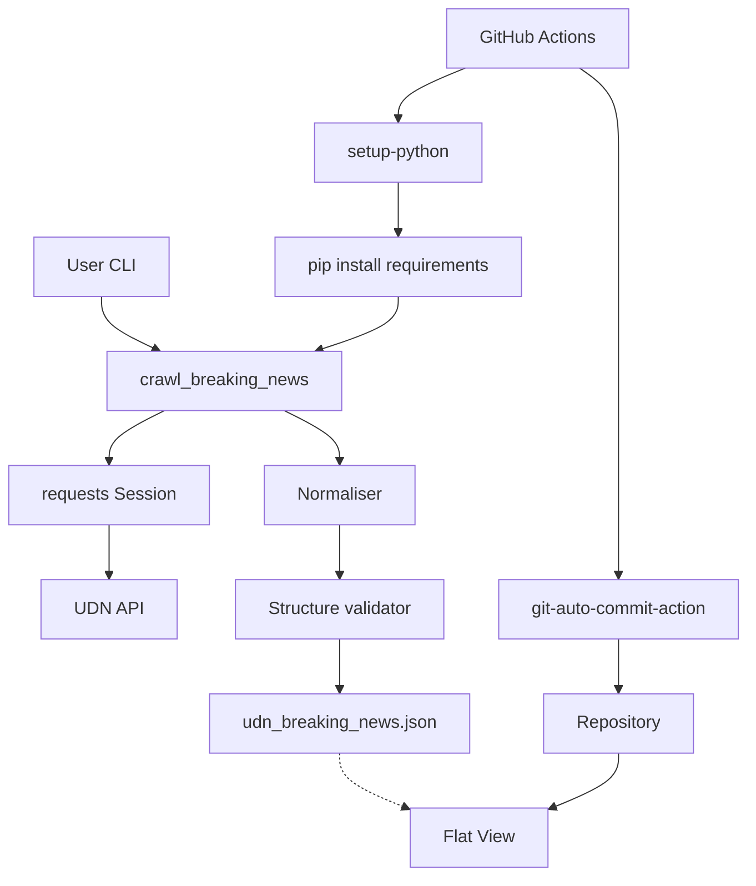
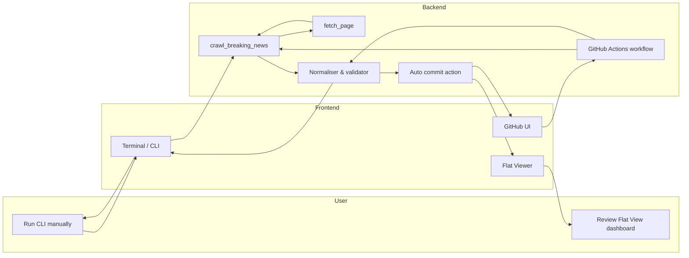

# test-scarp

```mermaid
gitGraph
    commit id: "Initial commit"
    branch main
    checkout main
    commit id: "Grant Flat workflow push permissions"
    branch codex/update-pagination-for-udn_crawler
    checkout codex/update-pagination-for-udn_crawler
    commit id: "Add crawler & diagrams"
    checkout main
    merge codex/update-pagination-for-udn_crawler id: "Merge PR #2"
    checkout codex/update-pagination-for-udn_crawler
    merge main id: "Sync main into feature"
    checkout main
    merge codex/update-pagination-for-udn_crawler id: "Merge PR #3"
    branch work
    checkout work
    commit id: "Flat dataset update"
    commit id: "Normalize dataset workflow"
```







```mermaid
decision-tree
    root((Start))
    root --> a{"Pages > 0?"}
    a -- No --> a0[Raise ValueError]
    a -- Yes --> b{"Workflow run?"}
    b -- Yes --> c[Install dependencies]
    c --> d{"CLI succeeded?"}
    b -- No --> e{"Delay > 0?"}
    e -- Yes --> f[Sleep between requests]
    e -- No --> g[Fetch pages immediately]
    d -- No --> h[Fail job]
    d -- Yes --> i[Normalise & write JSON]
    g --> i
    i --> j{"Validation passes?"}
    j -- Yes --> k[Commit updated dataset]
    j -- No --> h
```



A lightweight utility for downloading the latest breaking news headlines from UDN.

## Features

- Normalises responses from the official UDN breaking news endpoint.
- Supports configurable pagination and request throttling.
- Writes prettified JSON to disk for downstream processing.
- Provides a scheduled GitHub Actions workflow with the permissions required for Flat commits.

## Usage

```bash
python udn_crawler.py --pages 1 --delay 0 --output /tmp/udn.json
```

## Development

- Requires Python 3.10+.
- Install dependencies with `pip install -r requirements.txt` if you maintain a separate environment.
- Scheduled runs need repository contents write access enabled for the Flat workflow token.
