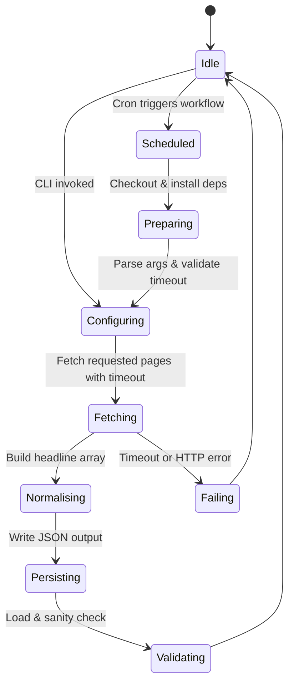
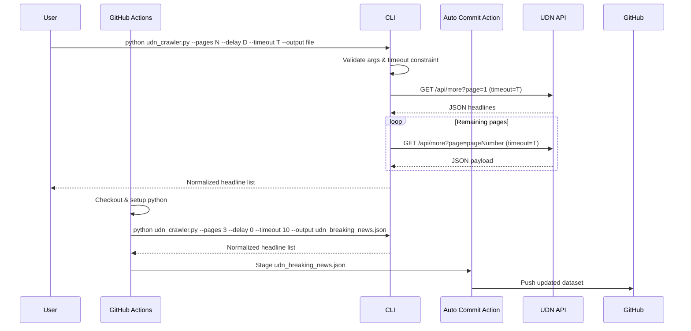
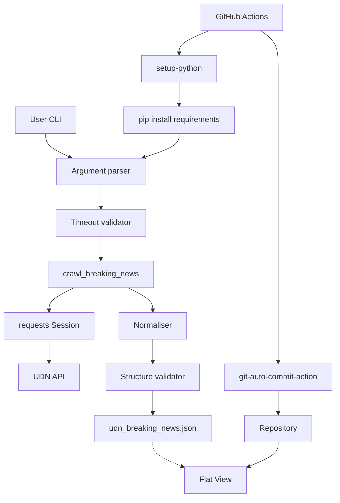

# test-scarp

```mermaid
gitGraph
    commit id: "Initial commit"
    branch main
    checkout main
    commit id: "Grant Flat workflow push permissions"
    branch codex/update-pagination-for-udn_crawler
    checkout codex/update-pagination-for-udn_crawler
    commit id: "Add crawler & diagrams"
    checkout main
    merge codex/update-pagination-for-udn_crawler id: "Merge PR #2"
    checkout codex/update-pagination-for-udn_crawler
    merge main id: "Sync main into feature"
    checkout main
    merge codex/update-pagination-for-udn_crawler id: "Merge PR #3"
    commit id: "Flat dataset update (13:42)"
    commit id: "Flat dataset update (14:02)"
    branch codex/update-github-actions-for-normalized-array
    checkout codex/update-github-actions-for-normalized-array
    commit id: "Normalize dataset workflow"
    merge main id: "Sync workflow branch"
    checkout main
    merge codex/update-github-actions-for-normalized-array id: "Merge PR #4"
    branch work
    checkout work
    commit id: "Update breaking news dataset"
    commit id: "Configurable request timeout"
```







```mermaid
decision-tree
    root((Start))
    root --> a{"Pages > 0?"}
    a -- No --> a0[Raise ValueError]
    a -- Yes --> t{"Timeout > 0?"}
    t -- No --> t0[Raise ValueError]
    t -- Yes --> b{"Workflow run?"}
    b -- Yes --> c[Install dependencies]
    c --> d{"CLI succeeded?"}
    b -- No --> e{"Delay > 0?"}
    e -- Yes --> f[Sleep between requests]
    e -- No --> g[Fetch pages immediately]
    d -- No --> h[Fail job]
    d -- Yes --> i[Normalise & write JSON]
    g --> i
    i --> j{"Validation passes?"}
    j -- Yes --> k[Commit updated dataset]
    j -- No --> h
```

```mermaid
flowchart LR
    subgraph User
        U1[Run CLI with pages/delay/timeout]
        U2[Review Flat View dashboard]
    end
    subgraph Frontend
        F1[Terminal / CLI]
        F2[GitHub UI]
        F3[Flat Viewer]
    end
    subgraph Backend
        B1[Argument parser validates timeout]
        B2[crawl_breaking_news]
        B3[fetch_page (requests with timeout)]
        B4[Normaliser & validator]
        B5[GitHub Actions workflow]
        B6[Auto commit action]
    end

    U1 --> F1 --> B1 --> B2 --> B3 --> B2
    B2 --> B4 --> F1 --> U1
    F2 --> B5 --> B1
    B5 --> B4 --> B6 --> F2
    B6 --> F3 --> U2
```

A lightweight utility for downloading the latest breaking news headlines from UDN.

## Features

- Normalises responses from the official UDN breaking news endpoint.
- Supports configurable pagination and request throttling.
- Allows configuring HTTP timeouts to better handle slow responses.
- Writes prettified JSON to disk for downstream processing.
- Provides a scheduled GitHub Actions workflow with the permissions required for Flat commits.

## Usage

```bash
python udn_crawler.py --pages 1 --delay 0 --timeout 10 --output /tmp/udn.json
```

## Development

- Requires Python 3.10+.
- Install dependencies with `pip install -r requirements.txt` if you maintain a separate environment.
- Scheduled runs need repository contents write access enabled for the Flat workflow token.
