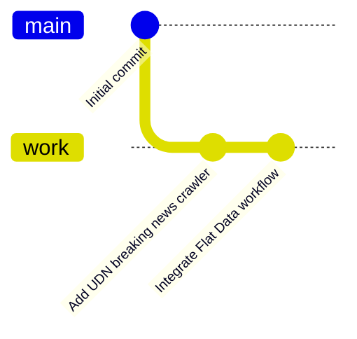
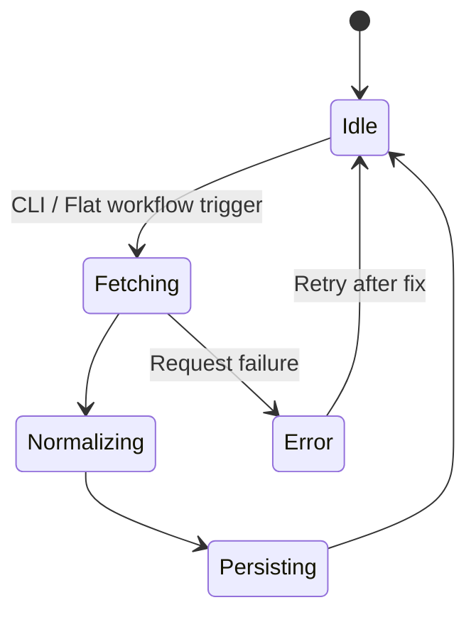
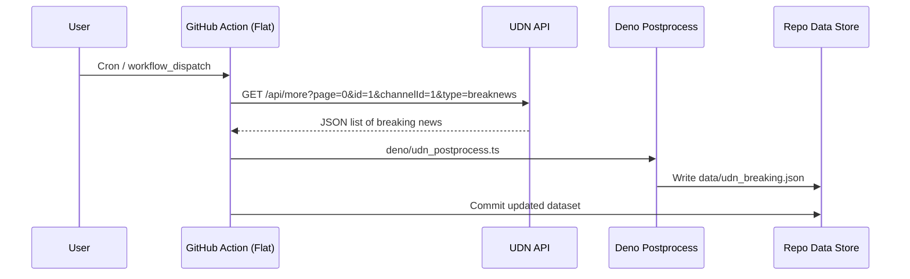
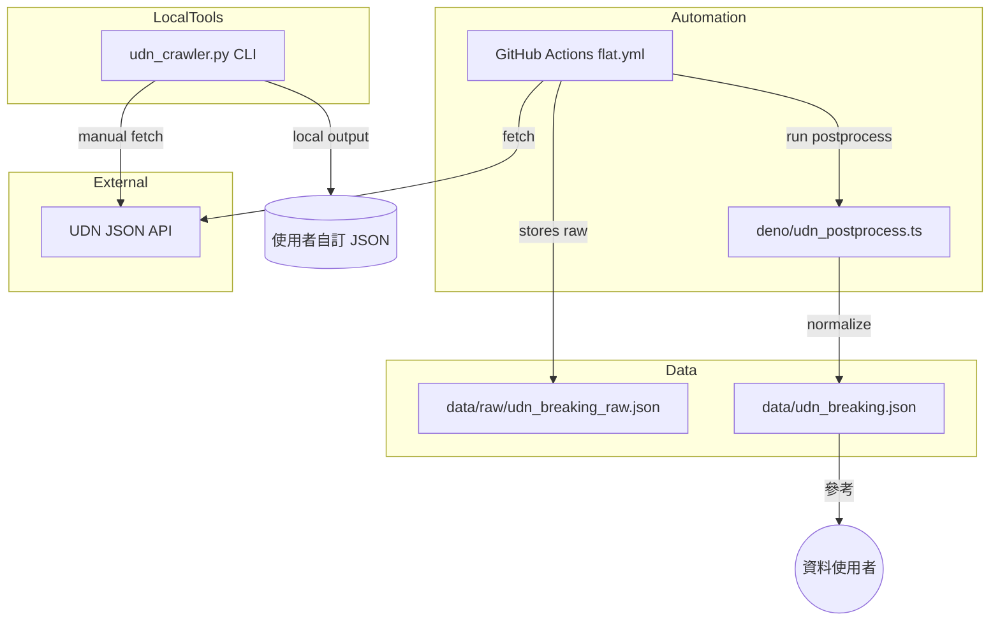
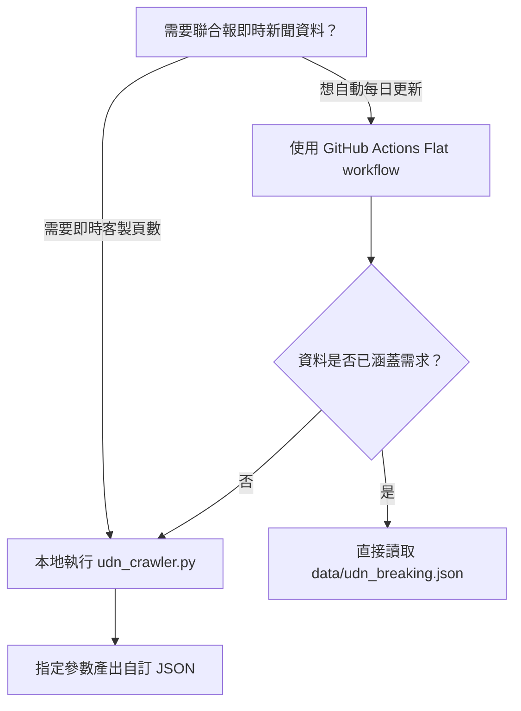
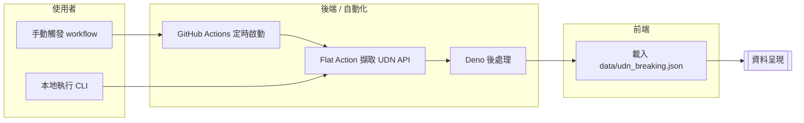

# 聯合報新聞爬蟲

## Mermaid 圖表總覽

### Git 歷史


### 系統狀態流程


### 工作序列


### 系統架構


### 決策樹


### Swimlane


## 專案概述

這個專案提供一個 Python 指令列工具與 GitHub Actions 工作流程，協助抓取聯合報（UDN）的即時新聞資料。指令列工具可在本地端快速客製化爬蟲需求，而 GitHub Actions 則透過 Flat Data Action 自動化下載與整理資料，並將整理後的 JSON 檔案存放在版本庫中。

## GitHub Actions 自動化（Flat Data）

- 工作流程檔案：`.github/workflows/flat.yml`
- 執行頻率：每小時（`0 * * * *`）自動抓取一次，亦可透過 *Run workflow* 手動觸發。
- 主要步驟：
  1. 透過 `githubocto/flat@v3` 從 `https://udn.com/api/more` 擷取最新即時新聞頁面資料，將原始回應存為 `data/raw/udn_breaking_raw.json`。
  2. 執行 `deno/udn_postprocess.ts`，利用 Deno 與 Flat 的 helper 將原始資料整理為乾淨的 `data/udn_breaking.json`。
  3. 若資料有變化，Flat 會自動建立 commit，確保資料持續更新。

> **注意**：首次啟動前請確認 repository 擁有預設的 `GITHUB_TOKEN` 寫入權限；若需要將資料發佈到其他分支或儲存空間，請依需求調整 workflow。

## 本地使用方式

```bash
python udn_crawler.py --pages 2 --output udn.json
```

常用參數說明：

- `--pages`：要抓取的頁數，預設為 1。
- `--delay`：每次請求之間的延遲秒數，預設為 1 秒，避免對伺服器造成壓力。
- `--category-id`、`--channel-id`、`--type`：對應聯合報 API 的參數，預設為即時新聞。
- `--output`：輸出檔案路徑；若不指定，結果會輸出到標準輸出。

## 資料輸出

- 自動化流程輸出的檔案為 `data/udn_breaking.json`，內容為經過欄位整理的 JSON 陣列，可直接提供前端或資料分析使用。
- 原始 API 回應會存放在 `data/raw/udn_breaking_raw.json`，方便比對或除錯。

以下範例展示整理後的資料格式：

```json
[
  {
    "title": "宜蘭泉月樓行館超狂防水一夕爆紅 卻有違建、農地未農用遭裁罰",
    "link": "https://udn.com/news/story/7320/8663558",
    "summary": "宜蘭五結鄉泉月樓行館以「防水超強」為賣點...",
    "time": "2024-03-20 12:34",
    "image": "https://pgw.udn.com.tw/gw/photo.php?u=..."
  }
]
```

> **提示**：執行前請確認環境能夠連線到 `https://udn.com`，並且適度調整延遲時間。
