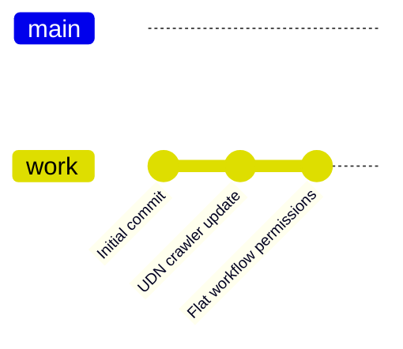
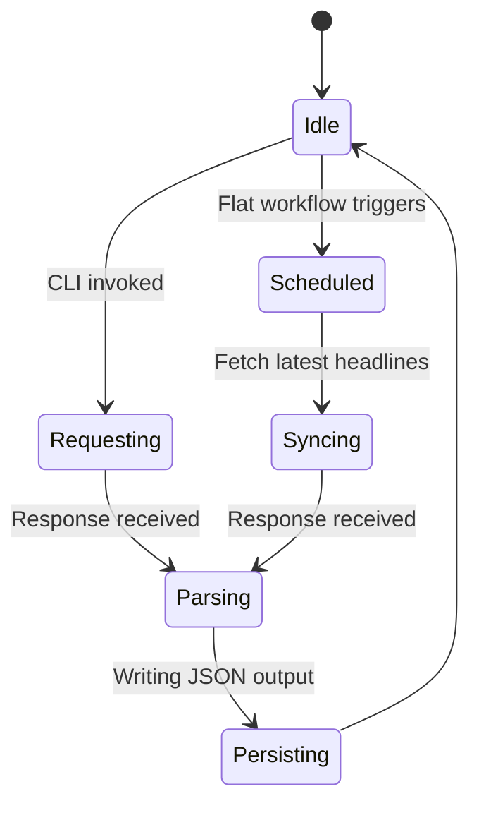
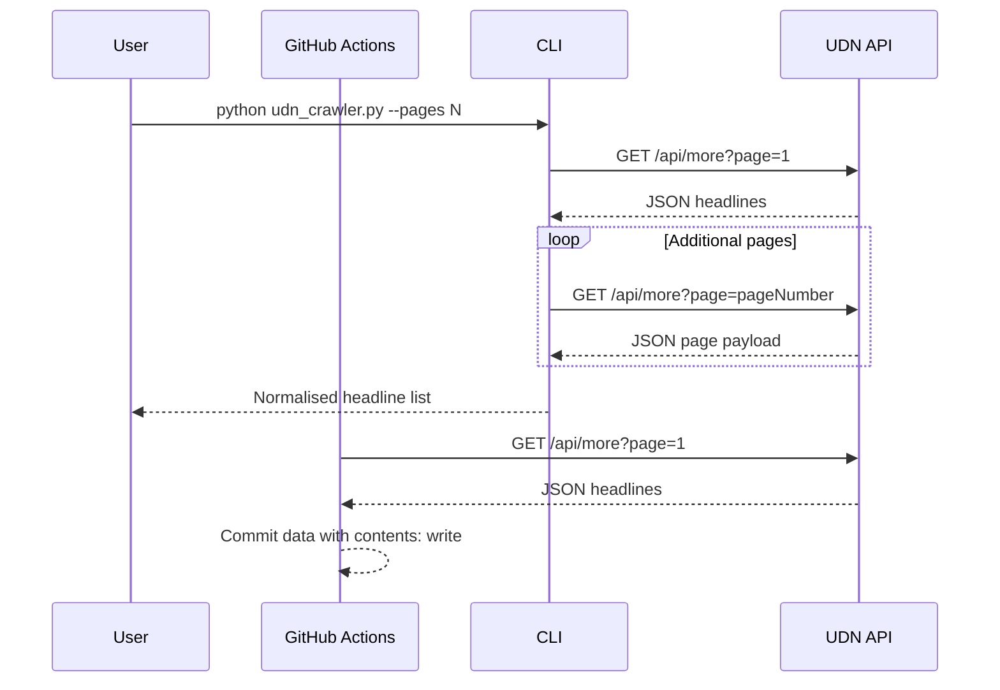
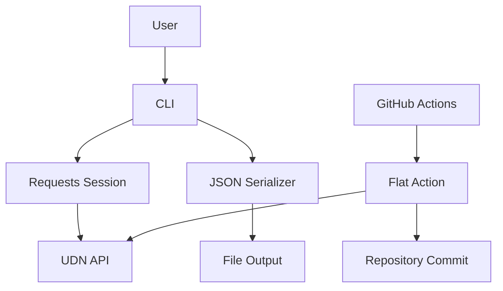
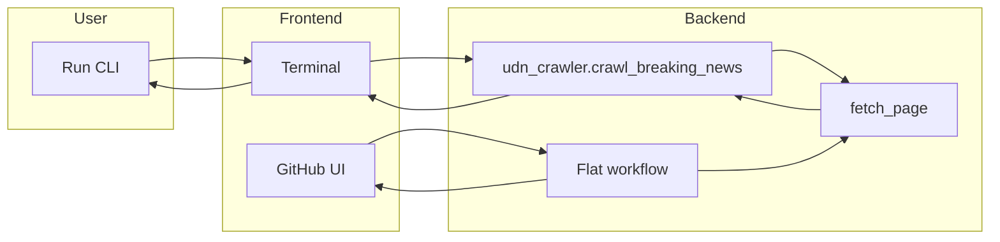

# test-scarp









```mermaid
decision-tree
    root((Start))
    root --> a{"Pages > 0?"}
    a -- No --> a0[Raise ValueError]
    a -- Yes --> b{"Triggered by Actions?"}
    b -- Yes --> e[Ensure contents: write permission]
    b -- No --> f{"Delay > 0?"}
    e --> f
    f -- No --> c[Fetch pages without waiting]
    f -- Yes --> d[Sleep between requests]
```



A lightweight utility for downloading the latest breaking news headlines from UDN.

## Features

- Normalises responses from the official UDN breaking news endpoint.
- Supports configurable pagination and request throttling.
- Writes prettified JSON to disk for downstream processing.
- Provides a scheduled GitHub Actions workflow with the permissions required for Flat commits.

## Usage

```bash
python udn_crawler.py --pages 1 --delay 0 --output /tmp/udn.json
```

## Development

- Requires Python 3.10+.
- Install dependencies with `pip install -r requirements.txt` if you maintain a separate environment.
- Scheduled runs need repository contents write access enabled for the Flat workflow token.
